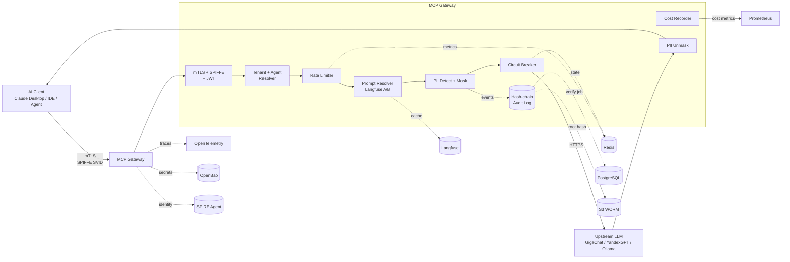

# MCP Gateway — Production-Grade AI Gateway

[](https://github.com/realrvs/mcp-gateway/actions/workflows/ci.yaml)
[](https://opensource.org/licenses/Apache-2.0)
[](https://go.dev/)
[](#roadmap)

> **Production-grade MCP Gateway** — корпоративный шлюз для Model Context Protocol
> трафика с mTLS/SPIFFE, tamper-evident audit log, PII redaction, multi-tenancy,
> observability и SLO-based reliability.

---

## Зачем это нужно

Агентные системы на базе LLM (MCP-серверы, tool-calling, multi-agent orchestration)
всё чаще внедряются в enterprise, но при выходе из PoC-стадии упираются в одни
и те же проблемы:

- **Безопасность** — между агентом и upstream-сервисами нужен mTLS с проверяемой
  identity, а не самоподписанные сертификаты.
- **Compliance** — PII не должны покидать периметр, а каждое действие должно быть
  зафиксировано в audit-логе, который нельзя подделать задним числом (GDPR, 152-ФЗ,
  PCI DSS, HIPAA).
- **Изоляция тенантов** — один шумный клиент не должен ронять gateway для остальных.
- **Наблюдаемость** — нужны SLO/SLI, а не «вроде работает».
- **LLM-Ops** — промпты эволюционируют, их изменения надо контролировать A/B тестами.
- **FinOps** — вызовы LLM дорогие, их надо лимитировать и учитывать per-tenant
  AND per-agent.

**MCP Gateway** — reference implementation, которая закрывает эти требования
«из коробки» и может использоваться как blueprint для внедрения агентных систем
в регулируемой среде.

---

## Ключевые возможности

| Возможность | Реализация | ADR |
|-------------|-----------|-----|
| 🔐 **mTLS с реальным SPIFFE/SPIRE** | SVID через Workload API, автоматическая ротация, SPIFFE ID allowlist | [0001](docs/adr/0001-use-spiffe-for-mtls.md) |
| 🔗 **Tamper-evident audit log** | HMAC-SHA256 hash-chain, canonical serialization (RFC 8785), off-site root hash (S3 WORM) | [0002](docs/adr/0002-hmac-hash-chain-for-audit.md) |
| ⚡ **Rate limiting** | Per-tenant sliding window на Redis + Lua, fail-open/closed per tier | [0003](docs/adr/0003-redis-for-rate-limiting.md) |
| 🏢 **Multi-tenancy** | Сквозной `tenant_id` через `context.Context`, типизированный TenantID, двойная проверка | [0004](docs/adr/0004-tenant-id-in-context.md) |
| 🔌 **Circuit breaker** | `sony/gobreaker` per-tenant × per-upstream, retry внутри breaker'а | [0005](docs/adr/0005-circuit-breaker-library-choice.md) |
| 📊 **Observability stack** | OpenTelemetry + Prometheus + Loki + Tempo + Langfuse | [0006](docs/adr/0006-observability-stack.md) |
| 🧪 **Prompt A/B testing** | Langfuse + labels, deterministic hash split, auto-rollback, LLM-as-a-Judge | [0007](docs/adr/0007-prompt-ab-testing.md) |
| 💰 **Cost attribution per agent** | agent_id в метриках, budget per agent, auto-throttle при overrun | [0008](docs/adr/0008-cost-attribution-per-agent.md) |
| 🕵️ **PII redaction** | Multi-layer (regex + NER + custom), reversible placeholders, streaming-safe | [0009](docs/adr/0009-pii-redaction.md) |
| 🔑 **Key management** | OpenBao (MPL 2.0), AppRole, RBAC policies, HMAC rotation 90 дней | [0010](docs/adr/0010-key-management.md) |
| ☸️ **Kubernetes-ready** | Helm-чарт с probes, NetworkPolicy, PodSecurityStandards, External Secrets | — |

---

## Архитектура



**Поток обработки `tools/call`:**

1. mTLS handshake → валидация SPIFFE SVID
2. Извлечение `tenant_id` и `agent_id` из JWT claim
3. Rate limit check для `(tenant, method)`
4. Prompt Resolver → A/B split через Langfuse
5. PII detection → маскирование промпта
6. Circuit breaker check для upstream
7. Вызов upstream LLM / MCP-сервера
8. PII unmask ответа (streaming-safe)
9. Cost recording: tokens, ₽ per (tenant, agent)
10. Запись в audit log (hash-chain)
11. Возврат клиенту

---

## Быстрый старт (локально)

### Требования

- **Go 1.23+**
- **Docker + Docker Compose** (для Redis, PostgreSQL, OpenBao, SPIRE, Langfuse)
- **Make** (опционально, но удобно)

### Запуск

```bash
# 1. Клонировать
git clone https://github.com/realrvs/mcp-gateway.git
cd mcp-gateway

# 2. Поднять инфраструктуру (Redis, Postgres, OpenBao, SPIRE, Langfuse)
docker-compose up -d

# 3. Установить зависимости Go
go mod download

# 4. Запустить gateway
make run
# или
go run ./cmd/gateway --config ./configs/local.yaml
```

Gateway будет доступен на `http://localhost:8080` (без TLS в локальной конфигурации).

### Проверка

```bash
# Healthcheck
curl http://localhost:8080/healthz
curl http://localhost:8080/readyz

# Метрики Prometheus
curl http://localhost:8080/metrics
```

---

## Структура репозитория

```
mcp-gateway/
├── cmd/gateway/              # точка входа
├── internal/
│   ├── auth/                 # mTLS, SPIFFE, JWT
│   ├── tenant/               # tenant context + middleware
│   ├── agent/                # agent resolver (ADR-0008)
│   ├── audit/                # hash-chain audit log
│   ├── pii/                  # PII detection + redaction
│   ├── ratelimit/            # per-tenant rate limiting
│   ├── breaker/              # circuit breaker
│   ├── prompt/               # Langfuse prompt resolver (ADR-0007)
│   ├── cost/                 # cost attribution (ADR-0008)
│   ├── keymanager/           # OpenBao client (ADR-0010)
│   ├── mcp/                  # MCP protocol handlers
│   ├── upstream/             # клиенты к LLM и MCP-серверам
│   ├── config/               # загрузка конфигурации
│   └── observability/        # метрики, трейсы, логи (ADR-0006)
├── configs/                  # YAML-конфигурации (local, prod, tenants, agents, budgets, pricing)
├── deploy/
│   ├── docker/               # Dockerfile
│   ├── spire/                # конфиги SPIRE server/agent
│   ├── openbao/              # конфиги OpenBao
│   ├── langfuse/             # конфиги Langfuse
│   └── helm/mcp-gateway/     # Helm-чарт
├── docs/
│   ├── blueprint.md          # целостная картина проекта
│   ├── adr/                  # Architecture Decision Records (10)
│   ├── architecture/         # C4-диаграммы, trust boundaries, data flow
│   ├── security/             # threat model, compliance mapping, key management
│   └── reliability/          # SLO, runbook, capacity planning
├── test/                     # integration, load, security, chaos
└── .github/workflows/        # CI/CD
```

---

## Документация

Полный набор архитектурных артефактов — то, что отличает reference implementation
от PoC.

### 📐 Blueprint

- **[Blueprint v3](docs/blueprint.md)** — целостное описание системы:
  C4 Context/Container/Cost Annotations, поток запроса, trust boundaries,
  FinOps, observability, roadmap

### 📝 ADR (Architecture Decision Records)

10 решений с обоснованием, рассмотрением альтернатив и последствий:

| # | Тема | Статус |
|---|------|--------|
| [0001](docs/adr/0001-use-spiffe-for-mtls.md) | SPIFFE/SPIRE для mTLS | ✅ Accepted |
| [0002](docs/adr/0002-hmac-hash-chain-for-audit.md) | HMAC hash-chain для audit log | ✅ Accepted |
| [0003](docs/adr/0003-redis-for-rate-limiting.md) | Redis для rate limiting | ✅ Accepted |
| [0004](docs/adr/0004-tenant-id-in-context.md) | tenant_id в context.Context | ✅ Accepted |
| [0005](docs/adr/0005-circuit-breaker-library-choice.md) | gobreaker для circuit breaker | ✅ Accepted |
| [0006](docs/adr/0006-observability-stack.md) | Unified observability stack | ✅ Accepted |
| [0007](docs/adr/0007-prompt-ab-testing.md) | Prompt A/B testing via Langfuse | 🚧 In Progress |
| [0008](docs/adr/0008-cost-attribution-per-agent.md) | Cost attribution per agent | 🚧 In Progress |
| [0009](docs/adr/0009-pii-redaction.md) | PII redaction pipeline | 📋 Planned |
| [0010](docs/adr/0010-key-management.md) | Key management (OpenBao) | 📋 Planned |

### 🛡️ Безопасность

- **[Threat Model v2](docs/security/threat-model.md)** — STRIDE + MITRE ATT&CK,
  25 угроз, compliance mapping (152-ФЗ, GDPR, PCI DSS, HIPAA, NIST 800-207)
- **[Compliance Mapping](docs/security/compliance-mapping.md)** — построчное
  соответствие требованиям регуляторов
- **[Key Management](docs/security/key-management.md)** — управление HMAC keys
  через OpenBao (см. ADR-0010)
- **[Incident Response](docs/security/incident-response.md)** — playbook на
  security-инциденты (TBD)

### 📊 Надёжность

- **[SLO](docs/reliability/slo.md)** — SLI/SLO/error budget policy,
  multi-window burn rate alerting (Google SRE-style), per-tier targets
- **[Runbook](docs/reliability/runbook.md)** — операционный runbook:
  диагностика по trace_id, runbooks для алертов, incident replay,
  escalation matrix, post-mortem template
- **[Capacity Planning](docs/reliability/capacity-planning.md)** — FinOps
  на российских LLM (GigaChat, YandexGPT, DeepSeek, Ollama), cost per 1M calls,
  unit economics, ROI ranking

---

## Стек

| Компонент | Технология |
|-----------|-----------|
| Язык | Go 1.23 |
| Identity | SPIFFE/SPIRE (`go-spiffe/v2`) |
| Secrets | **OpenBao** (MPL 2.0, fork Vault) |
| Rate limiting / CB state | Redis 7 |
| Audit storage | PostgreSQL 16 (append-only, RLS) |
| LLM observability | **Langfuse** (prompt versioning, A/B testing, evals) |
| Observability | OpenTelemetry, Prometheus, Loki, Tempo, Grafana |
| Deployment | Kubernetes, Helm, Docker (distroless) |
| MCP transport | Streamable HTTP + SSE + JSON-RPC 2.0 |
| LLM providers | GigaChat, YandexGPT, DeepSeek, Ollama |

---

## Конфигурация

Gateway конфигурируется через YAML + env override.

**`configs/local.yaml`** — для локальной разработки (TLS отключён):

```yaml
server:
  addr: ":8080"
  tls:
    enabled: false

tenants:
  - id: "dev"
    rate_limit:
      tools_call: 100
    pii_policy: "permissive"
```

**`configs/tenants.yaml`** — production-конфигурация тенантов:

```yaml
tenants:
  - id: "acme"
    tier: "enterprise"
    authorized_spiffe_ids:
      - "spiffe://mcp-gateway.local/ns/acme/sa/*"
    upstreams:
      llm:
        provider: "gigachat"
        model: "GigaChat-Pro"
    pii_policy: "strict"
    rate_limit:
      tools_call:
        limit: 1000
        window: "60s"
      redis_failure_mode: "fail-closed"
    agents:
      - id: "agent-customer-support"
        budget_rub_per_hour: 5000
      - id: "agent-internal-tools"
        budget_rub_per_hour: 500000
```

**`configs/budgets.yaml`** — бюджеты per agent (ADR-0008).
**`configs/pricing.yaml`** — прайсы LLM провайдеров (₽/1K tokens).

---

## Deployment (Kubernetes)

Helm-чарт в `deploy/helm/mcp-gateway/`:

```bash
helm install mcp-gateway ./deploy/helm/mcp-gateway \
  --namespace mcp \
  --create-namespace \
  --values ./deploy/helm/mcp-gateway/values.yaml
```

Чарт включает:
- Deployment с liveness/readiness/startup probes
- ServiceAccount с SPIFFE-аннотацией
- NetworkPolicy (egress allowlist)
- PodSecurityStandards (non-root, readOnlyRootFilesystem, drop ALL caps)
- ServiceMonitor для Prometheus Operator
- External Secrets Operator integration

**Секреты** — через External Secrets Operator, синхронизированные из **OpenBao**.
HMAC-ключи и API-ключи хранятся в OpenBao с RBAC-политиками (см. ADR-0010).

---

## Roadmap

### ✅ Phase 1: Foundation (Done)

- [x] Структура проекта (~60 файлов)
- [x] 10 ADR (0001-0010)
- [x] Blueprint v3
- [x] Threat Model v2 (25 угроз)
- [x] SLO.md
- [x] Capacity Planning (FinOps)
- [x] Runbook.md
- [x] CI (GitHub Actions)

### 🚧 Phase 2: Core (In Progress)

- [ ] MCP protocol handlers (initialize, tools/list, tools/call)
- [ ] Tenant middleware (ADR-0004)
- [ ] Agent resolver (ADR-0008)
- [ ] Rate limiter с Lua (ADR-0003)
- [ ] Audit logger (ADR-0002)
- [ ] Circuit breaker (ADR-0005)
- [ ] SPIFFE integration (ADR-0001)
- [ ] OpenBao client (ADR-0010)

### 📋 Phase 3: Security & Compliance

- [ ] PII redaction pipeline (ADR-0009)
- [ ] Threat model review с InfoSec
- [ ] Key management runbook
- [ ] Incident response runbook
- [ ] Penetration testing

### 📋 Phase 4: LLM-Ops

- [ ] Prompt A/B testing via Langfuse (ADR-0007)
- [ ] Cost attribution per agent (ADR-0008)
- [ ] Auto-rollback prompts
- [ ] Grafana dashboards (Cost by Agent)
- [ ] LLM-as-a-Judge evaluation

### 📋 Phase 5: Production Readiness

- [ ] Helm chart production-ready
- [ ] Multi-cluster deployment (SPIFFE Federation)
- [ ] Disaster recovery procedures
- [ ] External security audit
- [ ] Compliance certification (152-ФЗ, ISO 27001)

---

## Ограничения reference implementation

Это **reference implementation**, а не готовый продукт:

- Не предназначена для продакшена «как есть» — требует адаптации под конкретную
  инфраструктуру
- SPIFFE/SPIRE конфиги даны как примеры, требуют настройки под ваш trust domain
- PII detection на regex + NER может давать false positives/negatives —
  требуется per-tenant tuning
- Нет HA-конфигурации Redis/Postgres/OpenBao из коробки — предполагается
  использование managed-сервисов
- Нет admin UI — управление тенантами через YAML + reload
- Benchmark не проводился на production-железе (цель: 10k RPS, p99 <10ms)
- Penetration testing не проводился
- Цены на LLM даны как reference, требуют проверки по актуальным прайс-листам

Полный список — в [Blueprint v3, раздел 10.2](docs/blueprint.md#102-ограничения-reference-implementation).

---

## Связанные проекты

- **[agentic-orchestration-platform](https://github.com/realrvs/agentic-orchestration-platform)** —
  multi-agent платформа для enterprise (Python, A2A, WIMSE SVID, OPA/Rego, MCP)
- **[enterprise-agent-orchestration-blueprint](https://github.com/realrvs/enterprise-agent-orchestration-blueprint)** —
  архитектурный blueprint: BPMN + AI-агенты, WIMSE-безопасность, FinOps для LLM

---

## Лицензия

[Apache License 2.0](LICENSE)

---

## Автор

**Roman Sokolov** — Technical Program Manager | AI Infrastructure & Agentic Systems

- GitHub: [@realrvs](https://github.com/realrvs)
