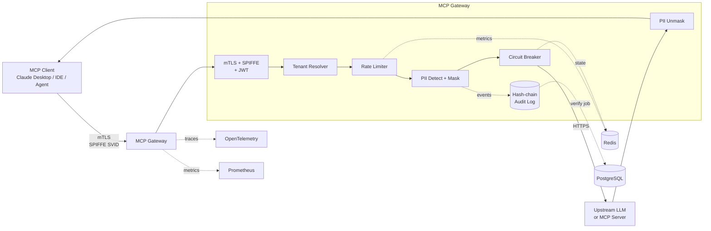

# MCP Gateway — Production-Grade AI Gateway

[](https://github.com/realrvs/mcp-gateway/actions/workflows/ci.yaml)
[](https://opensource.org/licenses/Apache-2.0)
[](https://go.dev/)
[](#roadmap)

> **Production-grade MCP Gateway** — корпоративный шлюз для Model Context Protocol трафика
> с mTLS/SPIFFE, tamper-evident audit log, PII redaction, multi-tenancy и SLO-based reliability.

---

## Зачем это нужно

Агентные системы на базе LLM (MCP-серверы, tool-calling, multi-agent orchestration) всё чаще
внедряются в enterprise, но при выходе из PoC-стадии упираются в одни и те же проблемы:

- **Безопасность** — между агентом и upstream-сервисами нужен mTLS с проверяемой identity,
  а не самоподписанные сертификаты.
- **Compliance** — PII не должны покидать периметр, а каждое действие должно быть
  зафиксировано в audit-логе, который нельзя подделать задним числом (GDPR, 152-ФЗ, PCI DSS, HIPAA).
- **Изоляция тенантов** — один шумный клиент не должен ронять gateway для остальных.
- **Наблюдаемость** — нужны SLO/SLI, а не «вроде работает».
- **Стоимость** — вызовы LLM дорогие, их надо лимитировать и учитывать per-tenant (FinOps).

**MCP Gateway** — reference implementation, которая закрывает эти требования «из коробки»
и может использоваться как blueprint для внедрения агентных систем в регулируемой среде.

---

## Ключевые возможности

| Возможность | Реализация |
|-------------|-----------|
| 🔐 **mTLS с реальным SPIFFE/SPIRE** | SVID через Workload API, автоматическая ротация, SPIFFE ID allowlist для авторизации |
| 🔗 **Tamper-evident audit log** | HMAC-SHA256 hash-chain, append-only storage, periodic verifier, ключ в Vault |
| 🕵️ **PII redaction** | Multi-layer detection (regex + NER), обратимые плейсхолдеры, streaming-safe pipeline |
| ⚡ **Rate limiting** | Per-tenant sliding window на Redis + Lua для атомарности, fail-open политика |
| 🔌 **Circuit breaker** | `sony/gobreaker`, изоляция per-tenant × per-upstream, метрики состояния |
| 🏢 **Multi-tenancy** | Сквозной `tenant_id` через `context.Context`, namespacing всех ресурсов |
| ☸️ **Kubernetes-ready** | Helm-чарт с probes, NetworkPolicy, PodSecurityStandards, External Secrets |
| 📊 **Observability** | Prometheus метрики, OpenTelemetry трейсы, structured JSON-логи с correlation ID |

---

## Архитектура



**Поток обработки `tools/call`:**

1. mTLS handshake → валидация SPIFFE SVID
2. Извлечение `tenant_id` из JWT claim / заголовка
3. Rate limit check для `(tenant, method)`
4. PII detection → маскирование промпта
5. Запись в audit log (hash-chain)
6. Circuit breaker check для upstream
7. Вызов upstream LLM / MCP-сервера
8. PII unmask ответа
9. Запись результата в audit log
10. Возврат клиенту

---

## Быстрый старт (локально)

### Требования

- **Go 1.23+**
- **Docker + Docker Compose** (для Redis, PostgreSQL, SPIRE)
- **Make** (опционально, но удобно)

### Запуск

```bash
# 1. Клонировать
git clone https://github.com/realrvs/mcp-gateway.git
cd mcp-gateway

# 2. Поднять инфраструктуру (Redis, Postgres, SPIRE)
docker-compose up -d

# 3. Установить зависимости Go
go mod download

# 4. Запустить gateway
make run
# или
go run ./cmd/gateway --config ./configs/local.yaml
```

Gateway будет доступен на `http://localhost:8080` (без TLS в локальной конфигурации).

### Проверка

```bash
# Healthcheck
curl http://localhost:8080/healthz
curl http://localhost:8080/readyz

# Метрики Prometheus
curl http://localhost:8080/metrics
```

---

## Структура репозитория

```
mcp-gateway/
├── cmd/gateway/              # точка входа
├── internal/
│   ├── auth/                 # mTLS, SPIFFE, JWT
│   ├── tenant/               # tenant context + middleware
│   ├── audit/                # hash-chain audit log
│   ├── pii/                  # PII detection + redaction
│   ├── ratelimit/            # per-tenant rate limiting
│   ├── breaker/              # circuit breaker
│   ├── mcp/                  # MCP protocol handlers
│   ├── upstream/             # клиенты к LLM и MCP-серверам
│   ├── config/               # загрузка конфигурации
│   └── observability/        # метрики, трейсы, логи
├── configs/                  # YAML-конфигурации (local, prod, tenants)
├── deploy/
│   ├── docker/               # Dockerfile
│   ├── spire/                # конфиги SPIRE server/agent
│   └── helm/mcp-gateway/     # Helm-чарт
├── docs/
│   ├── blueprint.md          # целостная картина проекта
│   ├── adr/                  # Architecture Decision Records
│   ├── architecture/         # C4-диаграммы, trust boundaries, data flow
│   ├── security/             # threat model, compliance mapping
│   └── reliability/          # SLO, runbook, capacity planning
├── test/                     # integration, load, security, chaos
└── .github/workflows/        # CI/CD
```

---

## Документация

Полный набор архитектурных артефактов — то, что отличает reference implementation от PoC:

- 📐 **[Blueprint](docs/blueprint.md)** — целостное описание системы, целевая архитектура, roadmap
- 📝 **[ADR](docs/decisions-log.md)** — 5 ключевых архитектурных решений с обоснованием:
  - [ADR-0001: SPIFFE/SPIRE для mTLS](docs/adr/0001-use-spiffe-for-mtls.md)
  - [ADR-0002: HMAC hash-chain для audit log](docs/adr/0002-hmac-hash-chain-for-audit.md)
  - [ADR-0003: Redis для rate limiting](docs/adr/0003-redis-for-rate-limiting.md)
  - [ADR-0004: tenant_id в context.Context](docs/adr/0004-tenant-id-in-context.md)
  - [ADR-0005: gobreaker для circuit breaker](docs/adr/0005-circuit-breaker-library-choice.md)
- 🛡️ **[Threat Model](docs/security/threat-model.md)** — STRIDE по компонентам + compliance mapping
  (152-ФЗ, GDPR, PCI DSS)
- 📊 **[SLO](docs/reliability/slo.md)** — SLI/SLO/error budget policy по тенантам
- 🚨 **[Runbook](docs/reliability/runbook.md)** — что делать при алертах
- 💰 **[Capacity Planning](docs/reliability/capacity-planning.md)** — FinOps, cost per 1M MCP calls

---

## Стек

| Компонент | Технология |
|-----------|-----------|
| Язык | Go 1.23 |
| Identity | SPIFFE/SPIRE (`go-spiffe/v2`) |
| Rate limiting / CB state | Redis 7 |
| Audit storage | PostgreSQL 16 (append-only, RLS) |
| Observability | Prometheus, OpenTelemetry, `slog` |
| Deployment | Kubernetes, Helm, Docker (distroless) |
| MCP transport | Streamable HTTP + SSE + JSON-RPC 2.0 |

---

## Конфигурация

Gateway конфигурируется через YAML + env override.

**`configs/local.yaml`** — для локальной разработки (TLS отключён):

```yaml
server:
  addr: ":8080"
  tls:
    enabled: false

tenants:
  - id: "dev"
    rate_limit:
      tools_call: 100
    pii_policy: "permissive"
```

**`configs/production.example.yaml`** — пример production-конфигурации с SPIFFE:

```yaml
server:
  addr: ":8443"
  tls:
    enabled: true
    spiffe:
      trust_domain: "example.org"

tenants:
  - id: "acme"
    rate_limit:
      tools_call: 1000
    pii_policy: "strict"
    circuit_breaker:
      max_requests: 3
      interval: "30s"
      timeout: "60s"
```

Полный список параметров — см. `configs/`.

---

## Deployment (Kubernetes)

Helm-чарт в `deploy/helm/mcp-gateway/`:

```bash
helm install mcp-gateway ./deploy/helm/mcp-gateway \
  --namespace mcp \
  --create-namespace \
  --values ./deploy/helm/mcp-gateway/values.yaml
```

Чарт включает:
- Deployment с liveness/readiness/startup probes
- ServiceAccount с SPIFFE-аннотацией
- NetworkPolicy (egress allowlist)
- PodSecurityStandards (non-root, readOnlyRootFilesystem, drop ALL caps)
- ServiceMonitor для Prometheus Operator

**Секреты** — через External Secrets Operator (Vault / AWS Secrets Manager / GCP SM).
HMAC-ключ audit log хранится отдельно с RBAC только для gateway SA.

---

## Roadmap

### ✅ Реализовано в PoC

- [x] Структура проекта + архитектурные артефакты (blueprint, ADR, threat model, SLO)
- [x] Docker Compose с Redis, Postgres, SPIRE
- [x] Helm-чарт с базовыми манифестами

### 🚧 В работе

- [ ] Рабочий MCP-транспорт (Streamable HTTP + SSE)
- [ ] SPIFFE/SPIRE интеграция в коде
- [ ] Hash-chain audit log с HMAC
- [ ] PII redaction pipeline
- [ ] Per-tenant rate limiting + circuit breaker
- [ ] Prometheus метрики + OpenTelemetry трейсы

### 📋 Планируется

- [ ] NER-based PII detection (Presidio sidecar)
- [ ] Multi-cluster deployment
- [ ] gRPC transport для MCP
- [ ] Admin UI для управления тенантами
- [ ] Cost tracking per tenant (FinOps)

---

## Ограничения reference implementation

Это **reference implementation**, а не готовый продукт:

- Не предназначена для продакшена «как есть» — требует адаптации под конкретную инфраструктуру
- SPIFFE/SPIRE конфиги даны как примеры, требуют настройки под ваш trust domain
- PII detection на regex-уровне может давать false positives/negatives — для production нужен NER + per-tenant правила
- Нет HA-конфигурации для Redis/Postgres из коробки — предполагается, что вы используете managed-сервисы

---

## Лицензия

[Apache License 2.0](LICENSE)

---

## Автор

**Roman Sokolov** — Technical Program Manager | AI Infrastructure & Agentic Systems

- GitHub: [@realrvs](https://github.com/realrvs)
- Связанные проекты:
  - [agentic-orchestration-platform](https://github.com/realrvs/agentic-orchestration-platform) — multi-agent платформа для enterprise
  - [enterprise-agent-orchestration-blueprint](https://github.com/realrvs/enterprise-agent-orchestration-blueprint) — архитектурный blueprint